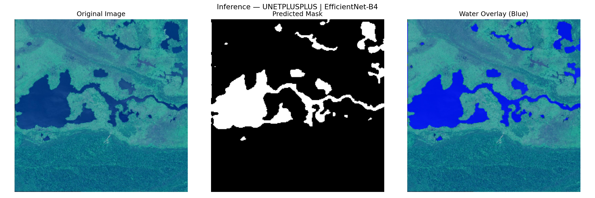

# Water Body Segmentation in Satellite Imagery

An end-to-end machine learning pipeline to detect and segment water bodies from satellite images using deep learning.
---

## Problem Statement

Given a satellite image captured by Sentinel-2, identify which pixels correspond to water bodies (lakes, rivers, ponds) and which correspond to land. This is a binary semantic segmentation task — every pixel is classified as either **water** or **non-water**.

---

## CI Status


---

## Project Structure

```
water-body-segmentation-in-satellite-images/
├── .github/
│   └── workflows/
│       └── ci.yml              # GitHub Actions CI pipeline
├── app/
│   ├── __init__.py
│   └── app.py                  # FastAPI inference web service
├── data/
│   ├── dataset.py              # PyTorch Dataset, augmentations, splits
│   ├── preprocess.py           # Filter tiny images, verify masks
│   └── valid_files.txt         # List of valid image filenames
├── eda/
│   └── eda.py                  # Dataset exploration and visualization
├── training/
│   ├── train.py                # Model training with W&B logging
│   ├── evaluate.py             # Test set evaluation
│   ├── losses.py               # BCE + Dice combined loss
│   └── metrics.py              # IoU, Dice, Precision, Recall
├── inference/
│   └── inference.py            # Standalone single-image inference
├── configs/
│   └── config.yaml             # All hyperparameters and paths
├── notebooks/
│   └── kaggle_launcher.ipynb   # Kaggle GPU training launcher
├── Dockerfile                  # Container for inference service
├── requirements.txt            # Full dependencies
└── README.md
```

---

## Dataset

- **Source:** [Satellite Images of Water Bodies](https://www.kaggle.com/datasets/franciscoescobar/satellite-images-of-water-bodies) by Francisco Escobar on Kaggle
- **Size:** 2,841 RGB image-mask pairs
- **Satellite:** Sentinel-2
- **Masks:** Generated using NDWI (Normalized Difference Water Index)
- **Format:** JPEG images with binary masks (white = water, black = land)

### Key EDA Findings
- Image resolutions range from 5px to 5640px — highly non-uniform
- 65 images smaller than 64x64 were filtered out — 2,776 valid pairs remain
- 95.7% of masks have intermediate pixel values due to JPEG compression — thresholded at 127 during loading
- Average water coverage per image: 32.89% — mild class imbalance

---

## Model Architecture

Both models use **EfficientNet-B4** as the encoder backbone with ImageNet pretrained weights. Implemented using [segmentation-models-pytorch](https://github.com/qubvel/segmentation_models.pytorch).

### Model 1 — U-Net (Baseline)
- Standard encoder-decoder with skip connections
- Simple, fast, strong baseline

### Model 2 — U-Net++ with scSE Attention (Main Model)
- Dense nested skip connections between encoder and decoder
- scSE (Spatial and Channel Squeeze and Excitation) attention on decoder
- Achieves higher recall — critical for water detection where missing water is worse than false alarms

---

## Experiment Setup

| Setting | Value |
|---|---|
| Image size | 256 x 256 |
| Batch size | 16 |
| Loss function | BCE + Dice (combined) |
| Optimizer | Adam |
| Learning rate | 0.0001 |
| LR scheduler | ReduceLROnPlateau (factor=0.5, patience=7) |
| Early stopping | Patience=12 |
| Dataset split | 80% train / 10% val / 10% test |
| Experiment tracking | Weights and Biases (W&B) |
| Training platform | Kaggle T4 GPU |

### Augmentations (training only)
- Horizontal flip
- Vertical flip
- Random 90 degree rotation
- Random brightness/contrast

---

## Results

### Validation Results (during training)

| Model | Best Val IoU | Val Dice | Epochs | Training Time |
|---|---|---|---|---|
| U-Net (lr=0.0001) | 0.8210 | 0.9001 | 45 | ~49 mins |
| U-Net++ + scSE | 0.8222 | 0.9013 | 47 | ~89 mins |

### Test Set Results (final evaluation on 279 unseen images)

| Model | IoU | Dice | Precision | Recall |
|---|---|---|---|---|
| U-Net (lr=0.0001, 45ep) | 0.8305 | 0.9065 | 0.9202 | 0.8952 |
| U-Net++ + scSE (deployed) | 0.8292 | 0.9054 | 0.9039 | 0.9083 |

**U-Net++ was selected for deployment** due to its superior recall (0.9083), which minimizes missed water detections — a critical requirement for environmental monitoring applications.

---

## Sample Predictions



---

## Quick Start

### 1. Clone the repository
```bash
git clone https://github.com/krantiprakash/water-body-segmentation-in-satellite-images.git
cd water-body-segmentation-in-satellite-images
```

### 2. Create and activate virtual environment
```bash
python -m venv myenv
source myenv/Scripts/activate  # Windows
source myenv/bin/activate       # Linux/Mac
```

### 3. Install dependencies
```bash
pip install -r requirements.txt
```

### 4. Run preprocessing (Only if you wants to retrain the model from scratch)
```bash
python data/preprocess.py
```

### 5. Run inference on a single image
Edit `MODEL_PATH` and `INPUT_IMAGE` in `inference/inference.py`, then:
```bash
python inference/inference.py
```

### 6. Run the web service locally
```bash
python -m app.app
```
Open `http://localhost:8000/` in browser, upload a satellite image, and get the predicted mask and water overlay.

---

## Docker Deployment

### Option 1 — Pull from DockerHub (recommended)
```bash
docker pull krntprksh/water-segmentation:v1
docker run -p 8000:8000 krntprksh/water-segmentation:v1
```
Open `http://localhost:8000/` in browser.

- Inference tested and working on CPU

### Option 2 — Build locally
```bash
docker build -t krntprksh/water-segmentation:v1 .
docker run -p 8000:8000 krntprksh/water-segmentation:v1
```

---

## API Endpoints

| Method | Endpoint | Description |
|---|---|---|
| GET | `/` | Web UI — upload image and view results |
| POST | `/predict` | Upload image, returns predicted mask |
| GET | `/overlay/{filename}` | Retrieve water overlay image |
| GET | `/health` | JSON health check |

### Example API call
```bash
curl -X POST "http://localhost:8000/predict" \
  -F "file=@satellite_image.jpg" \
  --output predicted_mask.jpg
```

---

## Training

### Local debug run (CPU, 2 epochs, 50 images)
Set `debug.enabled: true` in `configs/config.yaml`, then:
```bash
python training/train.py
```

### Full training on Kaggle GPU
1. Push code to GitHub
2. Open `notebooks/kaggle_launcher.ipynb` on Kaggle
3. Add dataset: `franciscoescobar/satellite-images-of-water-bodies`
4. Add W&B secret: `WANDB_API_KEY`
5. Run all cells

To switch between U-Net and U-Net++, update `configs/config.yaml`:
```yaml
model:
  name: "unetplusplus"   # or "unet"
  attention: "scse"      # or null for unet
```

---

## Optimizations

| Optimization | Details |
|---|---|
| CPU-only Docker image | Uses torch+cpu — reduces image size significantly |
| Model loaded once at startup | Avoids reloading on every request |
| Lightweight base image | python:3.12-slim — minimal OS footprint |
| Separate docker requirements | requirements-docker.txt excludes CUDA packages |

---

## Limitations and Future Work

- Images resized to 256x256 — fine detail loss for large rasters. Patch-based tiling would improve accuracy for very large satellite images
- Test Time Augmentation (TTA) could improve IoU by 1-2%
- Higher resolution training (320x320 or 512x512) may yield better boundary detection
- Cloud deployment (Railway/AWS) for public access

---

## Tech Stack

| Component | Technology |
|---|---|
| Deep Learning | PyTorch |
| Segmentation | segmentation-models-pytorch |
| Augmentation | Albumentations |
| Experiment Tracking | Weights and Biases (W&B) |
| Inference API | FastAPI + Uvicorn |
| Containerization | Docker |
| Training Platform | Kaggle T4 GPU |
| Version Control | Git + GitHub |